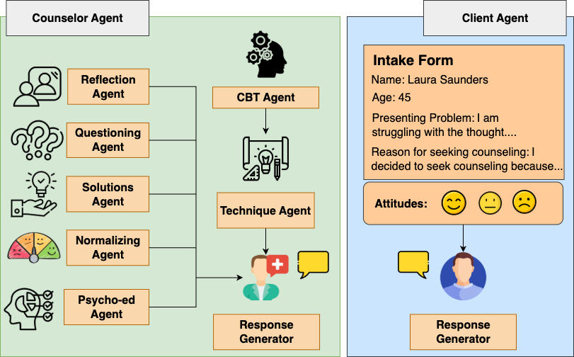

# MASCS-Gen: Multi-Agent Synthetic Counseling Session Generation
<p align="center">

</p>

## Summary


## Abstract

## Contact
For any questions contact: [Aishik Mandal](mailto:aishik.mandal@tu-darmstadt.de) <br>
[UKP Lab](https://www.informatik.tu-darmstadt.de/ukp/ukp_home/index.en.jsp) | [TU Darmstadt](https://www.tu-darmstadt.de/) 

## Creating the environment

```
python3 -m venv env
source env/bin/activate
pip install -r requirements.txt
```

## Code Structure


## Cite

Please use the following citation:

```
@InProceedings{smith:20xx:CONFERENCE_TITLE,
  author    = {Smith, John},
  title     = {My Paper Title},
  booktitle = {Proceedings of the 20XX Conference on XXXX},
  month     = mmm,
  year      = {20xx},
  address   = {Gotham City, USA},
  publisher = {Association for XXX},
  pages     = {XXXX--XXXX},
  url       = {http://xxxx.xxx}
}
```

## Disclaimer

> This repository contains experimental software and is published for the sole purpose of giving additional background details on the respective publication. 
